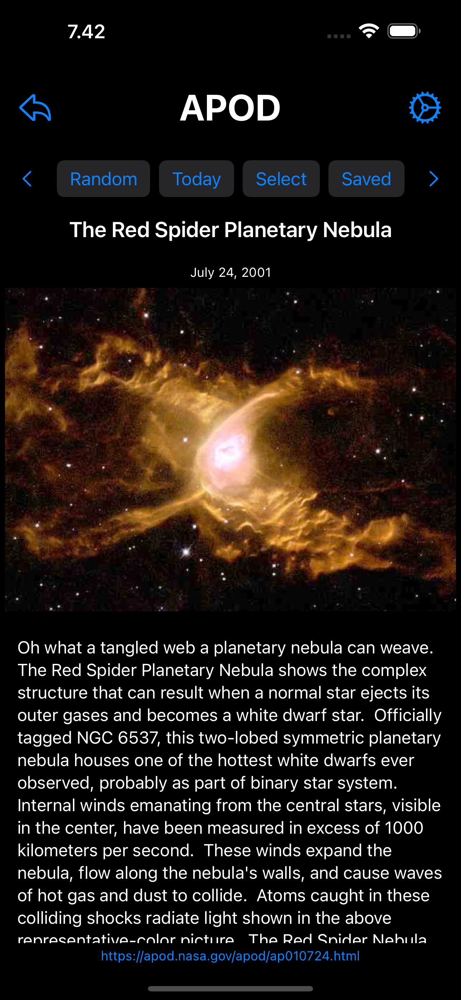

= X-A/P

Description from the Apple App Store (generated by ChatGPT and slightly modified):

> XAP (X-App/Platform) brings together a variety of mini-apps in one place, ready to help you tackle everything from quick server tasks to a bit of gaming. Whether you need a simple SSH client, a route planner to get where you already are, or a tool to track sunrise and sunset times, XAP has you covered. With more features in development - from user-suggested ideas to entirely new utilities - this all-in-one app aims to keep things fresh and exciting for everyone.

> At the heart of XAP is a vision for continuous growth, but it’s also a personal passion project. While new features and improvements will come as inspiration (and free time) allow, the pace of updates often depends on feedback, user suggestions, and overall interest in the app. In other words, the more you use and enjoy XAP, the more motivation there is to build and refine new mini-apps. Download XAP now to see what it can do for you - and perhaps even help shape what it becomes next!

== Shape what becomes next

Open an issue. 

== X-Apps

[cols="^.^1,^.^1,^.^2,^.^4"]
|===

|Icon
|Name
|Description
|Screenshot

| 
|APOD
|Astronomy Picture Of The Day - from NASA.
| 

|Cell in column 1, row 2
|Location
|Cell in column 2, row 1 
|Cell in column 2, row 1 

|Cell in column 1, row 3
|Cell in column 2, row 3 
|Cell in column 2, row 1 
|Cell in column 2, row 1 

|=== 

- APOD - Astronomy Picture of the Day. From NASA.
