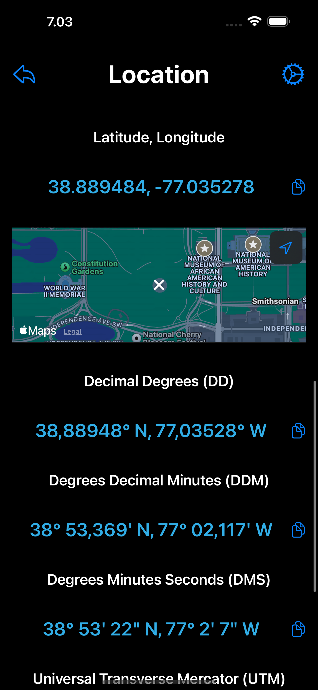
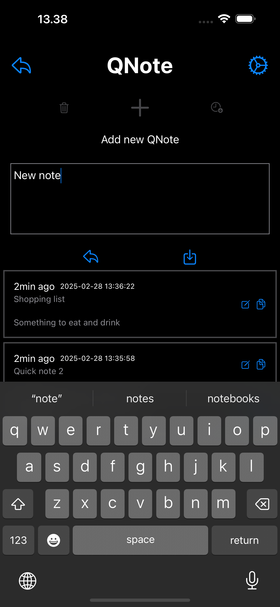

= X-A/P

Description from the Apple App Store (generated by ChatGPT and slightly modified):

> X-A/P (X-App/Platform) brings together a variety of mini-apps in one place, ready to help you tackle everything from quick server tasks to a bit of gaming. Whether you need a simple SSH client, a route planner to get where you already are, or a tool to track sunrise and sunset times, X-A/P has you covered. With more features in development - from user-suggested ideas to entirely new utilities - this all-in-one app aims to keep things fresh and exciting for everyone.

> At the heart of X-A/P is a vision for continuous growth, but it’s also a personal passion project. While new features and improvements will come as inspiration (and free time) allow, the pace of updates often depends on feedback, user suggestions, and overall interest in the app. In other words, the more you use and enjoy X-A/P, the more motivation there is to build and refine new mini-apps. 

> Download X-A/P now to see what it can do for you - and perhaps even help shape what it becomes next!

== Shape what becomes next

Open an issue. 

== Full Access

The app is free and it include Full Access in-app purchase. Full Access will enable all features of current and all future x-apps.

== Privacy policy

link:privacy.adoc[Privacy policy].

== X-Apps

[cols="^.^1,^.^1,^.^2,^.^2"]
|===

|Icon
|Name
|Description
|Screenshot

|image:images/icons/app-icon.jpg[X-A/P icon,200] 
|X-A/P
|X-App/Platform - a collection of x-apps.
| 

|image:images/icons/apod.jpg[APOD icon,200] 
|APOD
|Astronomy Picture Of The Day - from NASA.
| 

| 
|Location
|Current location latitude and longitude.
| 

| 
|Sunrise/Sunset
|Sunrise and sunset times in the current location.
| 

| 
|Gravity Three
|A game.
| 

| 
|Proverbs & Quotes
|Thousands of proverbs and quotes. And an image of a thinker.
| 

| 
|Route A2A
|When You Want To Go To Where You Already Are.
| 

| 
|Contours
|Contours of an image.
|image:images/screenshots/contours.png[Contours,50%] 

| 
|Gravity Four
|A game. Guide a ray to rotating black hole.
| 

| 
|CLP
|Command Line Program. Commands in shell-like environment.
| 

| 
|Mystrl Flip
|Flip a "coin".
| 

| 
|SSH Client
|Connect to your server using SSH. Use password or private key.
| 

| 
|2048
|Yet another version of sliding tile puzzle game by Italian web developer Gabriele Cirulli.
| 

| 
|QNote
|Quick notes. Write (temporary) notes for yourself.
| 

| 
|ELIZA
|A mock Rogerian psychotherapist.
| 

| 
|MQTT Client
|Test your MQTT with this client.
| 

| 
|Mtrx Rain
|Raining characters.
| 

|=== 
